ওকে তো তাহলে কিভাবে ডাটা সায়েন্স এর জন্যে পিসি সেটআপ করা দরকার ওটা step  by step দেখে নি

To run Python in our machine, we mainly will be using 2 ways. যার যেটা সহজ লাগে সেই অনুযায়ী দুইটা উপায় দিয়ে দিলাম।

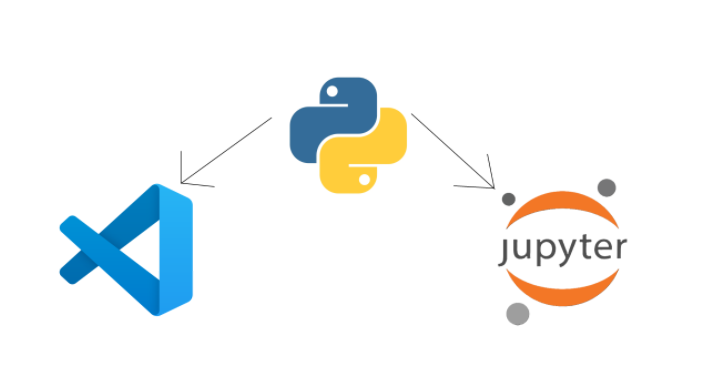

At first we need to install Python. To do that first

- Go to [Python's Website](https://www.python.org/downloads/)
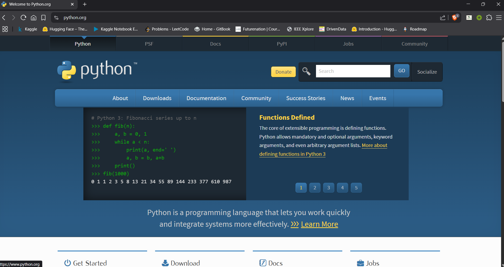

- Click on Downloads -> Windows
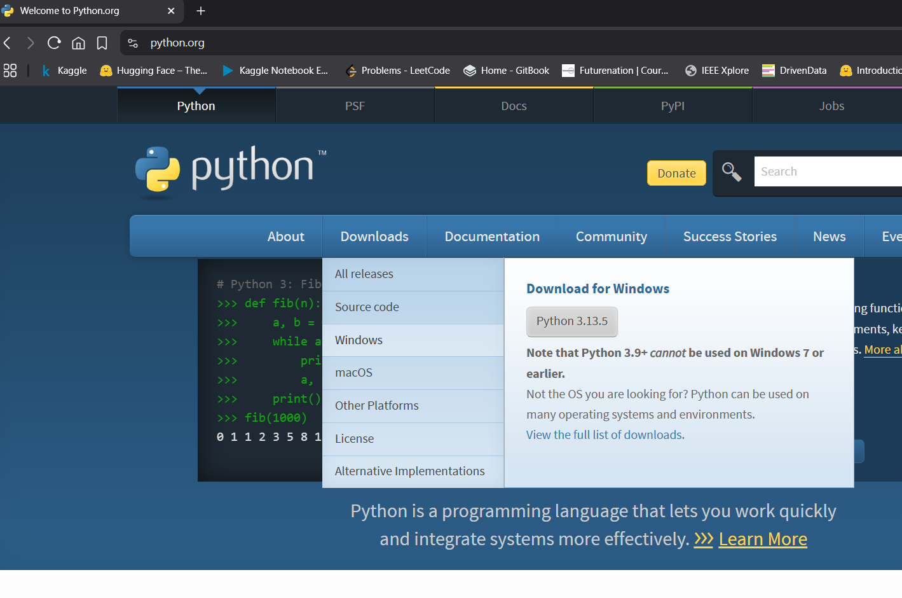

- এখন একটা বিষয় হল অনেক লাইব্রেরী আসে জেগুলো Latest version support করে না, বরঞ্চ পুরনো কিছু ভার্সন এর সাথে সামঞ্জস্যপূর্ণ , তাই সব বিবেচনায় আমার কাছে <b>Python (3.11-3.12)</b> best option মনে হয়েছে। যাহোক , এখন আমরা নামিয়ে নেই 64 bit installer
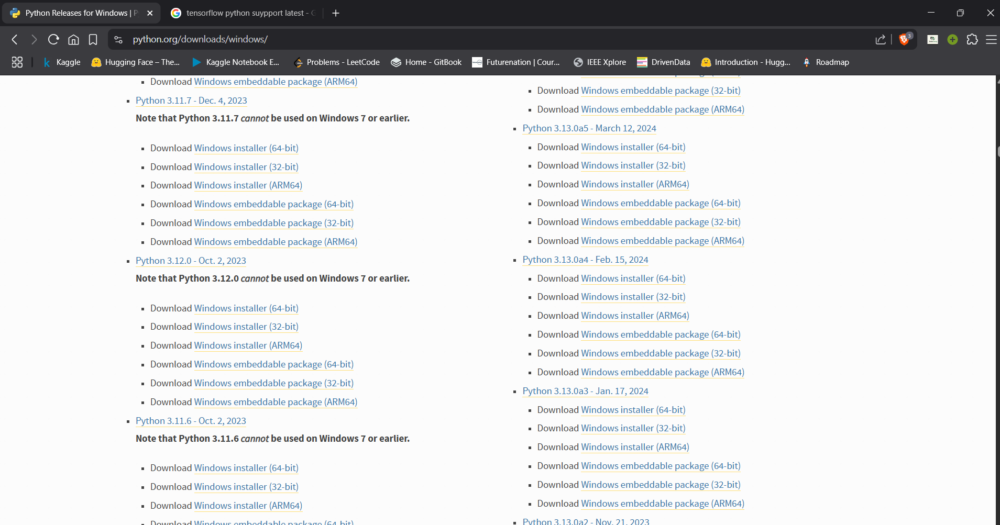

- এখানে গুরুত্বপূর্ণ বিষয় হল, নিচের দুইটা অপশন অন করে এরপরে install করতে হবে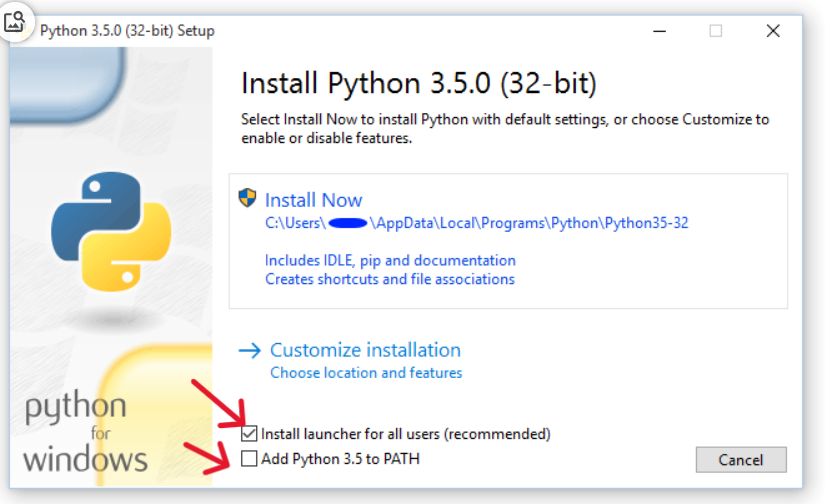

---
# Method 1
- এবার আমরা প্রথমে এই কমান্ড দিয়ে jupyter notebook নামক প্যাকেজ নামাবো 
`pip install jupyter notebook`
 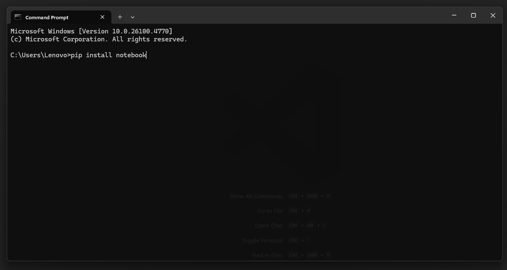
এক মিনিট! প্যাকেজ কি বুঝলাম না তো! ওকে একটা ছোট উদাহরণ দেই। মনে করেন অভ্র ভাই আজকে একটা প্রোগ্রাম বানাল যেটা দিয়ে আমরা সহজে সার্চ করে varsity এর গুরুত্বপূর্ণ তথ্য পেতে পারি। এখন আমি আজকে একটা ওয়েবসাইট বানাব, তো এখন আমি যদি নিজে থেকে varsity এর তথ্য খোজার প্রোগ্রাম না বানিয়ে অভ্র ভাই এর প্রোগ্রাম টা ব্যবহার করি, তাইলে তো আমার কাজ আর করা লাগে না, তাই না? তো এই অভ্র ভাই এর ব্যবহার যোগ্য প্রোগ্রাম বা ফাইল টাই হল প্যাকেজ। jupyter notebook তেমন একটা প্যাকেজ যেটা দিয়ে আমরা python এর line by line code compilation করতে পারি। এটা একটা ওয়েবসাইট এর মতো। এখন আমরা নামানোর পর cmd তে run করব।

- এখন নিচের যেকোনো দুইটার একটা command দিয়ে আমরা run করবো 
 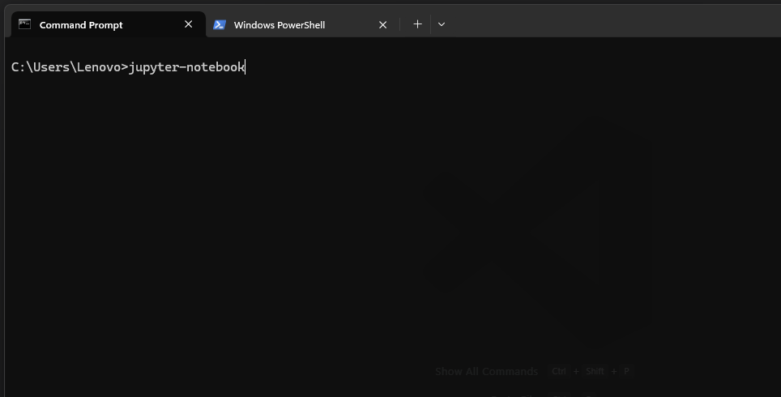
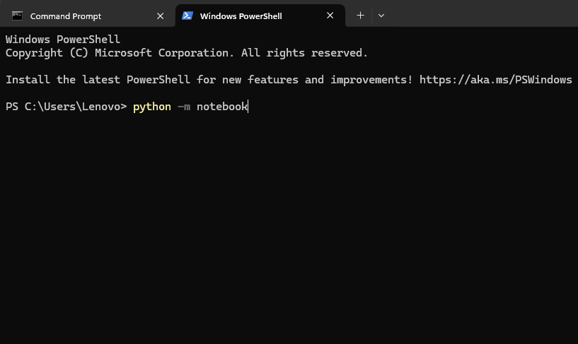

- এরপর automatic আমাদের browser open হবে আর আমরা এরকম কিছু দেখতে পারব

  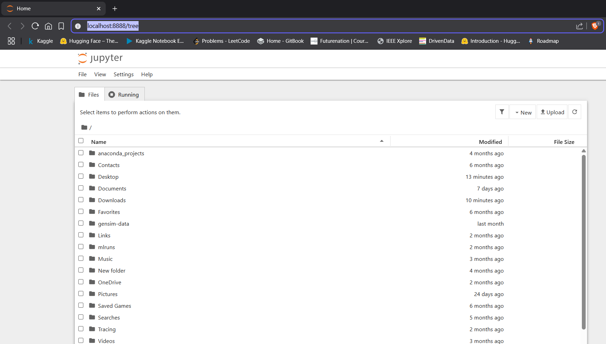
আবার অনেক time auto না ও খুলতে পারে, সেই ক্ষেত্রে command prompt থেকে এই url copy paste করে দিব আমাদের যেকোনো browser ওপেন করে
  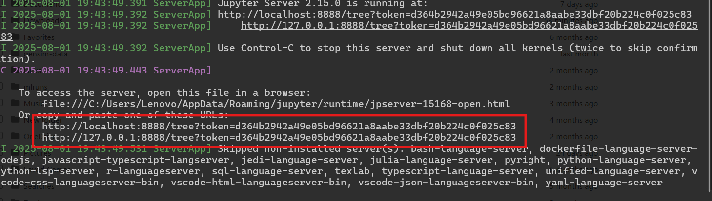
- এবার আমরা ডান পাশের উপরে new তে ক্লিক করে নতুন ফাইল খুলব 
  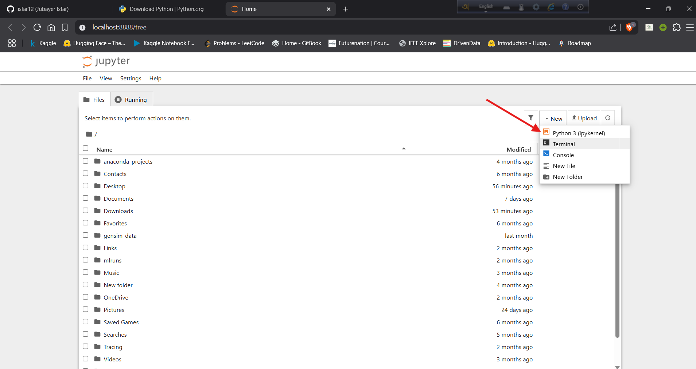
- In the end, we will run our python codes line by line. 
  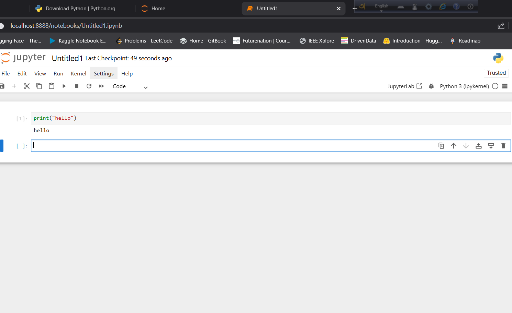

### Congratulations! Setup is complete!
---
# Method 2
- এবার আমরা প্রথমে vs code ওপেন করবো আর এক্সটেনশন নামাবো কিছু
 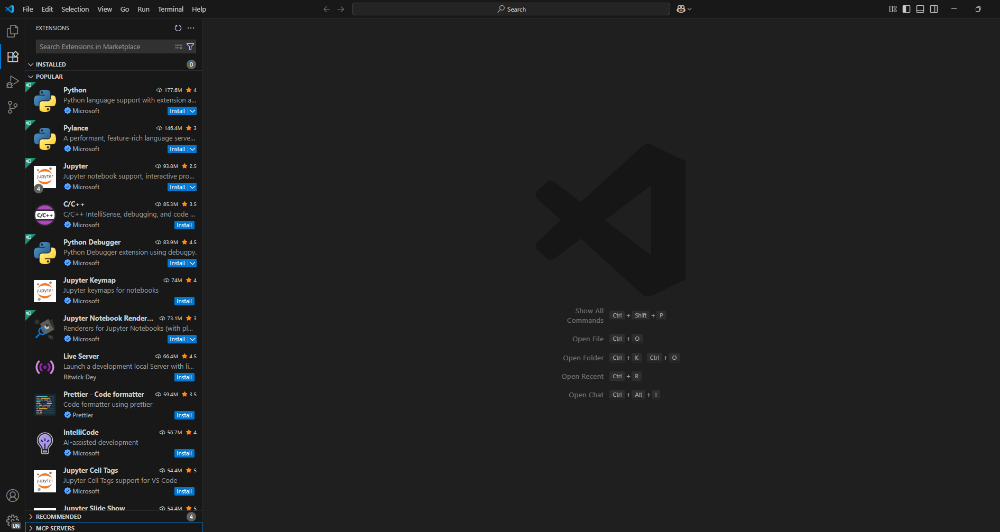
গুরুত্বপূর্ণ জেসব extension লাগবে আমাদেরঃ
    -  Python
    -  Jupyter
    -  IntelliCode ( Autocomplete/ Suggestions)
    -  Code Runner

- vs code এ আমাদের ফাইল বানাতে হবে ম্যানুয়ালি । এই ফাইলের extension হবে 
<b>filename_u_choose.ipynb</b> 

- এরপর আমাদের environment choose করা লাগবে। কারন vs code তো জানে না, আমরা ওকে কি কাজে ব্যবহার করতেসি। তো আমরা সিলেক্ট করবো পাইথন এর ভার্সনস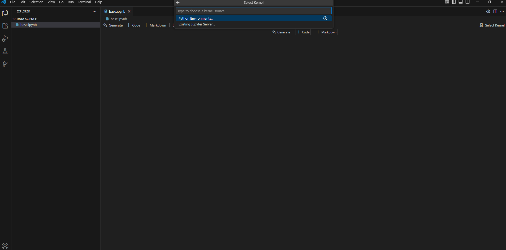

- এখানে খুব গুরুত্বপূর্ণ বিষয় যেটা ভাবতে হবে তা হলো, আগে থেকে যারা c/c++ use করেন, তারা mingw/msys64.../python.exe এরকম অপশন দেখতে পারবেন, অগুলো সিলেক্ট করা যাবে না। করতে হবে appdata/local/.../python.exe যেই ভার্সন আসে ওটা 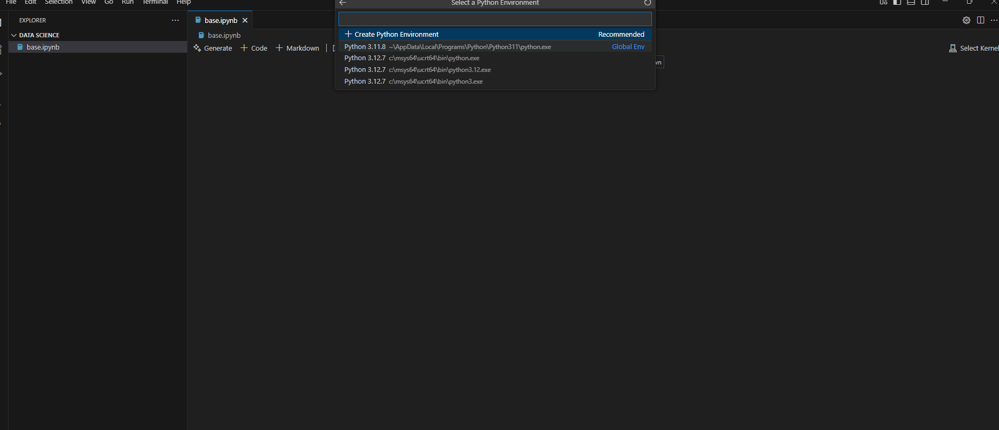

  
- Now there are 3 most important thing you can see. On the right, you can see your python kernal is selected, meaning your vs code is ready to run code.

    On the left, there are some options, `Code` and `Markdown` 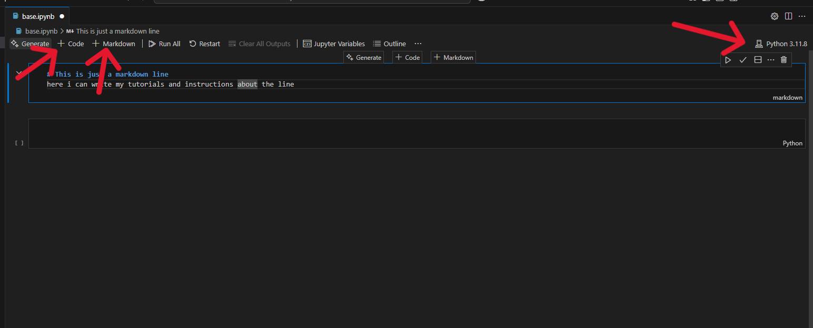 এখন কোড অপশন এর মাধ্যমে আমরা method 1 এর মতো কোড লিখে run করব। আর markdown এর কাজ টা সহজ ভাষায় যদি বলি, অনেটা ডকুমেন্টে লিখার মতো, মানে আমরা নিচের বা উপরের লাইনে যে কোড করব, ওটার কারন বা explain বা কোন note লিখা আরকি

- এবার আমরা Control + Enter অথবা অখানে ।> এই বাটন এ ক্লিক করলে অউটপুট দেখব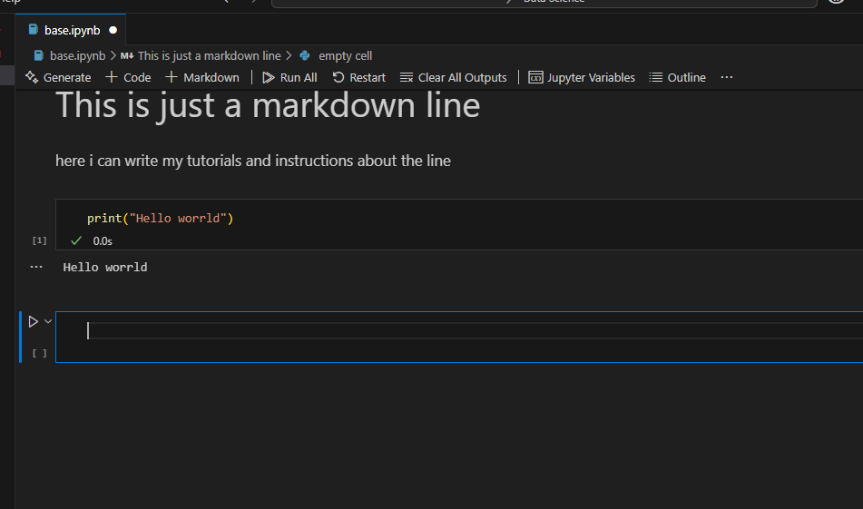

- In the end, we will run our python codes line by line. 
  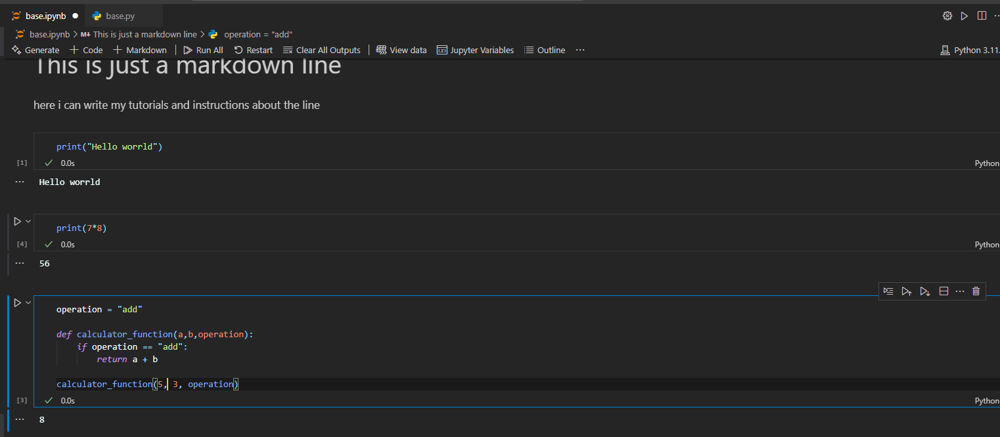

---